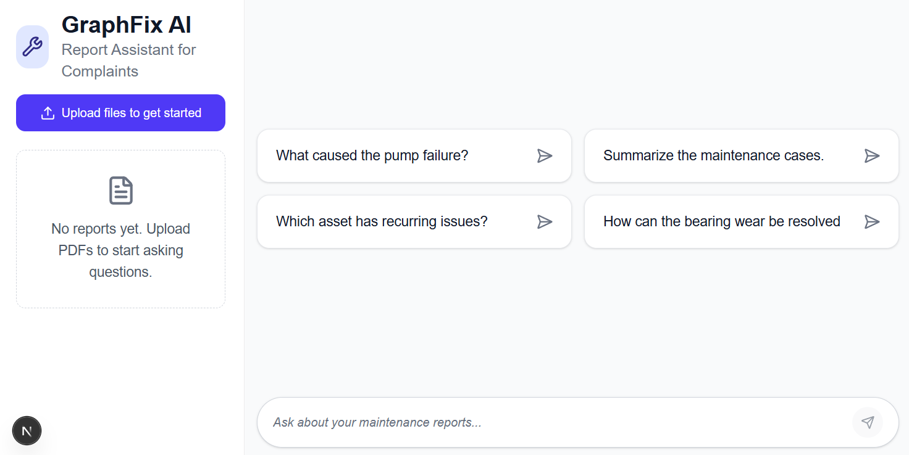
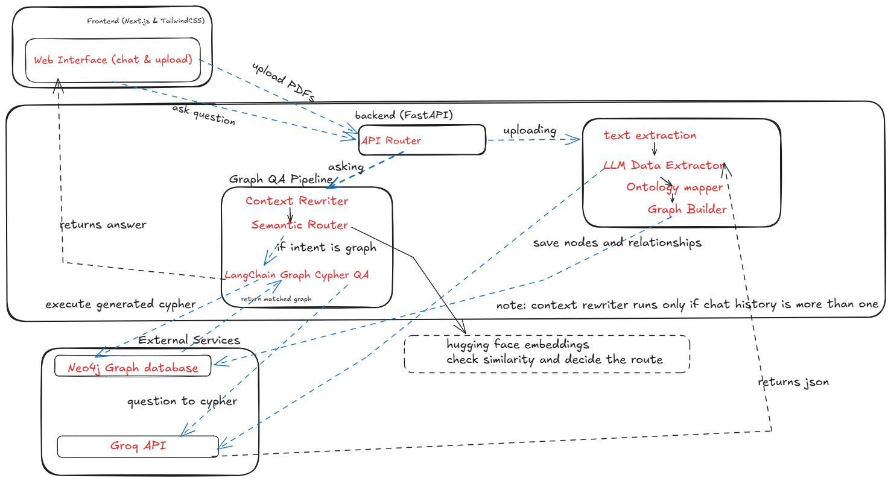

# GraphFix AI

GraphFix AI is a conversational AI assistant that enables maintenance engineers and technical professionals to analyze maintenance reports through natural language. It transforms unstructured maintenance reports into a  knowledge graph, allowing users to ask questions about assets, components, failures, maintenance actions, and their relationships.

Instead of manually skimming through large collections of maintenance documents, users can interact with the system conversationally to retrieve relevant maintenance history and discover relationships.

## Architecture

